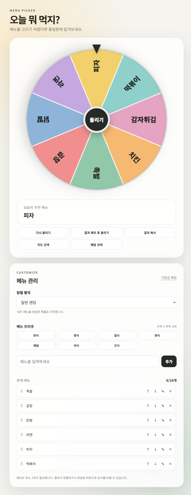

# 오늘 뭐 먹지? — 메뉴 추천 돌림판

메뉴를 직접 구성하고 돌림판을 돌려 식사 메뉴를 추첨하는 웹 애플리케이션입니다.
별도 설치 없이 브라우저에서 실행할 수 있습니다.

[GitHub Pages에서 실행하기](https://allen8524.github.io/menu-wheel/)



## 주요 기능

- 메뉴 추가·수정·삭제 및 드래그나 버튼을 이용한 순서 변경
- 한식, 중식, 일식 등 메뉴 프리셋
- 일반 랜덤, 직전 결과 제외, 당첨 메뉴 제거, 전체 메뉴 순환의 4가지 추첨 방식
- LocalStorage를 이용한 메뉴와 설정 자동 저장
- 반응형 UI와 Canvas 기반 돌림판

## 사용 기술

HTML5, CSS3, Vanilla JavaScript, Canvas API, LocalStorage, Drag and Drop API

## 실행 방법

- `index.html`을 브라우저에서 직접 엽니다.
- 로컬 서버를 사용하려면 다음 명령을 실행한 뒤 `http://localhost:5500`에 접속합니다.

```bash
python -m http.server 5500
```

## 라이선스

[MIT License](LICENSE)
